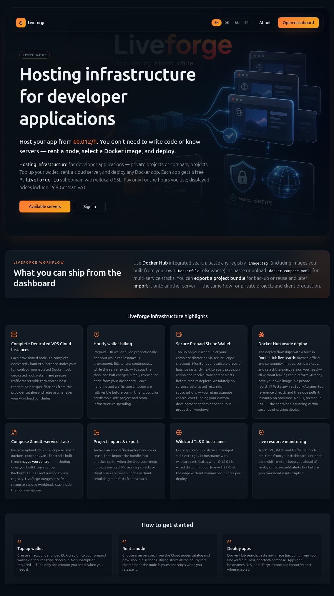
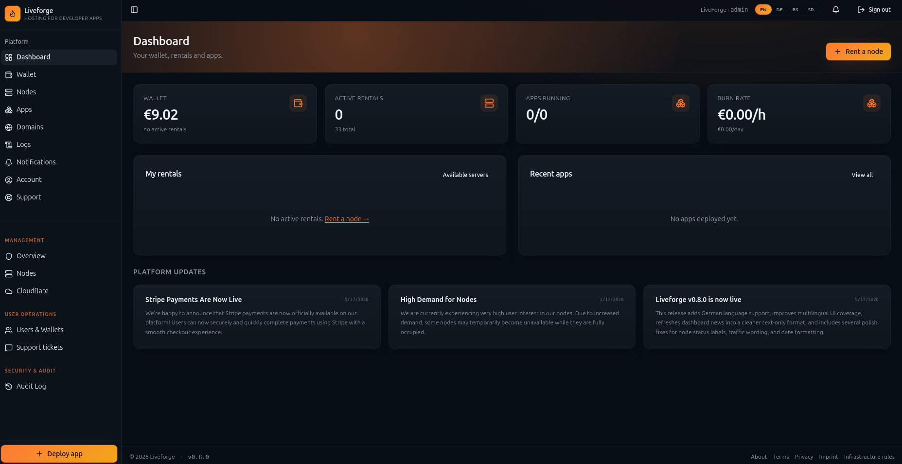
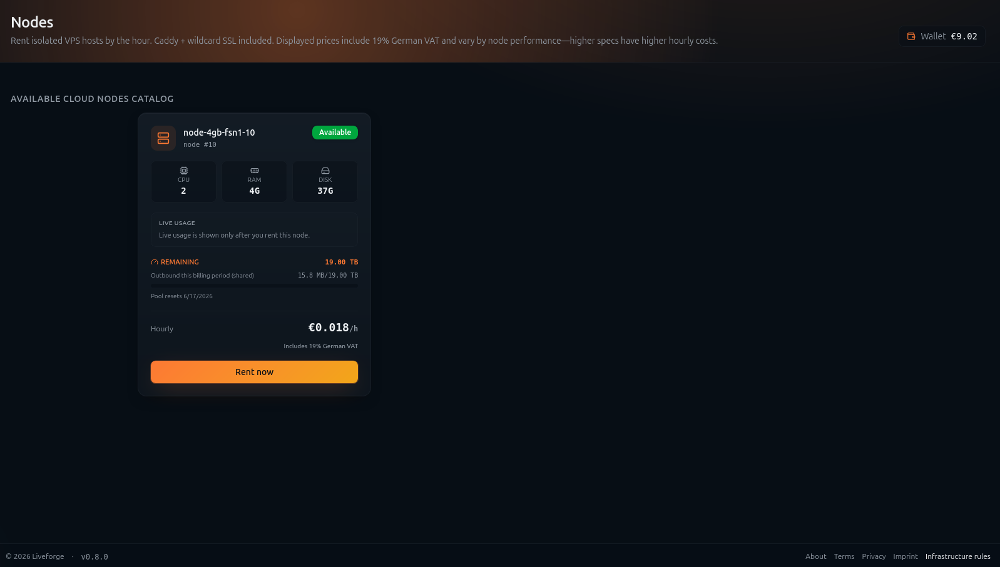
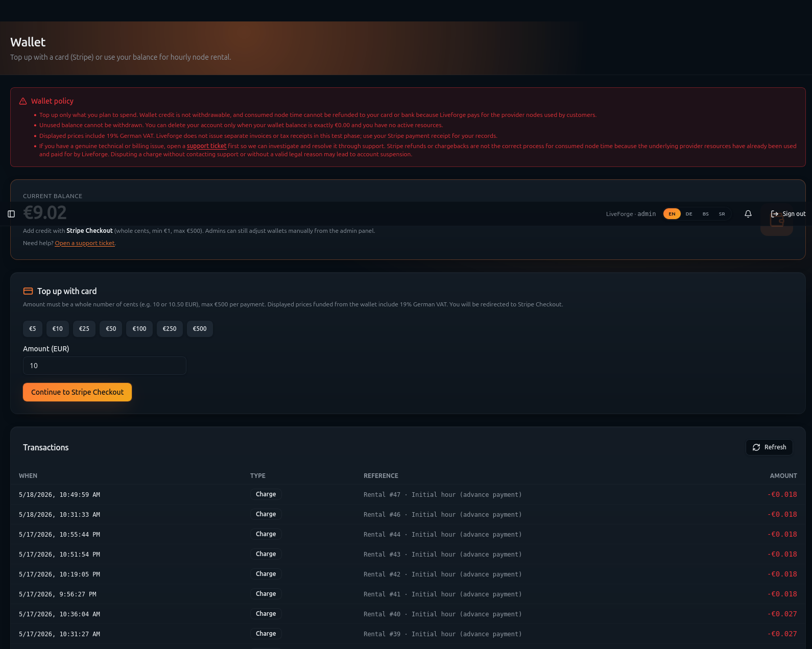
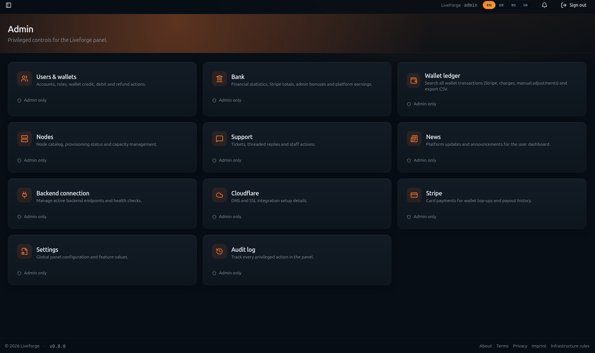
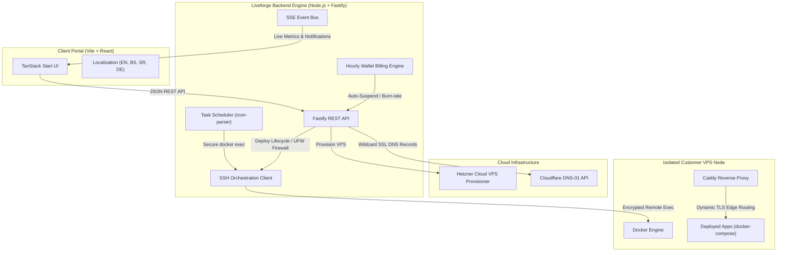

# 🌌 Liveforge — Commercial PaaS & On-Demand VPS Hosting Infrastructure

> **🔥 COMPLETE PROPRIETARY PROJECT FOR SALE / NA PRODAJU 🔥**
> 
> Own a fully-functional, production-tested, developer-first Platform-as-a-Service (PaaS) and Cloud VPS Hosting Orchestration Panel. Ready to launch as a standalone business, white-label service, or SaaS product.
>
> 🚀 **Live Demo Site:** [https://www.liveforge.io](https://www.liveforge.io)  
> ✉️ **Inquiries & Purchase Contact:** **[bhtech2024@gmail.com](mailto:bhtech2024@gmail.com)**

---

## 📸 Screen Previews

Here is a visual overview of the premium, developer-first user interface of the Liveforge platform:

| 🏠 Homepage / Landing Page |
| :---: |
|  |

| 📊 Client Dashboard & App Orchestration | 🖥️ Dedicated VPS Nodes Manager |
| :---: | :---: |
|  |  |

| 💳 Prepaid Wallet & Stripe Billing | 🛡️ Operator Controls (Admin Panel) |
| :---: | :---: |
|  |  |

---

## 💼 What Is For Sale?

By purchasing this project, you acquire the complete rights, source code, and production deployment pipeline of a modern, enterprise-grade cloud hosting software:

* **Production-Grade Monorepo**: Complete Frontend (Vite + TanStack Start + SSR + React 19) and Backend Engine (Node.js + Fastify + PostgreSQL).
* **Cryptographic Domain License Verification Engine**: Built-in V8 bytecode generation scripts to compile and license the software to third-party clients (fully protecting your intellectual property, ensuring client instances can only run on their licensed domains).
* **Automated VPS Server Provisioning & Setup scripts**: Automates UFW firewalls, Docker engines, and Caddy proxy layers on newly spawned Hetzner Cloud instances (easily adaptable to other VPS providers).
* **Fully Integrated Financial Ledger**: Secure Stripe payments processing, real-time burn-rate calculations, and automated credit balance tracking.
* **MFA OTP Security Gates**: Multi-factor email OTP logins and restricted operator admin panels.
* **Real-Time Observability Stack**: SSE streams for live health metrics (CPU, RAM, Disk, Net), container logs, and deployment events.

---

## 🛠️ How It Works (System Architecture)

Liveforge connects your client panel directly with cloud server providers and remote Docker daemons through a secure, highly optimized orchestration architecture:

### 1. On-Demand VPS Provisioning
When a user rents a server, the backend communicates with the **Hetzner Cloud API** to spawn a fresh, isolated VPS. Over a secure SSH tunnel, the Liveforge engine automatically prepares the instance:
- Installs and configures the **Docker Engine**.
- Sets up a secure **UFW Firewall** allowing only traffic ports (80/443) and encrypted control channels.
- Deploys a managed **Caddy** edge router.

### 2. Multi-Tenant Edge Routing & Wildcard SSL
When you deploy an application, the engine updates DNS records dynamically via the **Cloudflare API**. It routes `<app-slug>.<your-domain>.com` to the node. The local Caddy proxy terminates TLS at the network edge, using Cloudflare DNS-01 challenges to retrieve automatic wildcard SSL certificates. Your application containers remain isolated in a private Docker bridge network.

### 3. Encrypted Remote Orchestration
Because SSH access is restricted for host security, all lifecycle commands (e.g., Deploy, Stop, Restart, Rebuild, Migrate) are executed securely inside container sandboxes using a remote, encrypted **Docker API SSH Client** built directly into the engine.

### 4. Hourly Prepaid Wallet System
Liveforge runs a strict double-entry journal balance system. It debits prepaid wallets hourly based on rented VPS specifications. If a wallet runs out of balance, the billing worker automatically suspends active server resources and safely stops application containers to avoid unbilled provider charges.

---

## 🌟 Core Features

### 🐳 Secure Container Orchestration
* **Docker Hub Search**: Search and pull public images directly inside the panel, or paste custom references from private registries.
* **Complex Compose Stacks**: Paste or upload fully customized `docker-compose.yaml` files. The deployment parser strips unsafe bindings (e.g., privileged mode, host network, docker socket) to preserve node security.
* **Backup & Export**: Package your entire app workspace (definitions, variables, and volumes) into `.tar.gz` bundles, ready to be migrated or restored.
* **App Migrations**: Move active workloads between different VPS instances in under 60 seconds with automated DNS re-propagation.

### ⏰ Scheduled Tasks (Cron System)
* **Sandboxed Executions**: Automate internal container maintenance (database cleanups, log rotations, cache refreshes) using standard shell commands run securely inside the sandbox.
* **UTC Timezone-Locked**: Built on top of an ESM `cron-parser` to compute exact UTC execution ticks, preventing host-level time offsets.
* **Templates**: Access hourly cleanups, daily log rotations, weekly session purges, or 15-minute health check self-pings instantly.
* **Logging Terminal**: Inspect output logs, stdout/stderr streams, execution durations, and exit codes in a console-styled log explorer.

### 💸 Financial Ledger & Wallet
* **Stripe Checkout Webhooks**: Instantly top up balance using credit card payments processed securely via Stripe.
* **Prepaid Burn-Rate Gauges**: Interactive dashboard meters indicating exact remaining runtimes and daily burn rates based on your active rentals.

### 📊 Real-Time Observability
* **Live SSE Streams**: Push notifications, deployment lifecycle events, and node health signals pushed instantly to client web browsers.
* **Metrics Gauges**: Live CPU, RAM, and network transmission metrics streamed using remote Unix `/proc` data collection.
* **Docker Logs terminal**: Interactive live-tail stdout and stderr logging panel.

### 🛡️ Operator Controls (Admin Panel)
* **MFA OTP Admin Gate**: Restricted administrative gates accessible only via a one-time verification code sent to the platform operator's inbox.
* **Ledgers & Bank Audits**: Deep ledger transaction tables, daily/monthly platform income statistics, and active capacity control charts.

### 🌍 Universal Multi-Language Support
Full localizations (plumbing through dynamic React translations) across all pages, forms, and dialog templates:
* 🇺🇸 **English (EN)**
* 🇧🇦 **Bosnian (BS)**
* 🇷🇸 **Serbian (SR - Cyrillic)**
* 🇩🇪 **German (DE)**

---

## 💻 Tech Stack

### Client Frontend
* **Core**: React 19 (TypeScript), Vite
* **Routing & Meta**: TanStack Start (SSR Routing)
* **Data Sync**: TanStack Query (React Query)
* **Styling**: Vanilla CSS, Tailwind CSS (Utility classes)
* **Icons & Feedback**: Lucide Icons, Sonner toasts

### Backend Engine
* **Core**: Node.js, Fastify (High performance)
* **Database**: PostgreSQL (with transactional schemas & migration engine)
* **Cryptography & Auth**: JSON Web Tokens (JWT), bcrypt
* **Orchestration**: SSH2 Client, Docker Engine SDK, `cron-parser`

---

## ✉️ Inquiry & Acquisition Details

This software is commercial, proprietary, and fully tested in a live staging environment. For pricing, full repository access, technical walk-throughs, or commercial inquiries, contact BHTech:

* **Contact Email**: **[bhtech2024@gmail.com](mailto:bhtech2024@gmail.com)**
* **Official Website / Demo:** **[https://www.liveforge.io](https://www.liveforge.io)**
